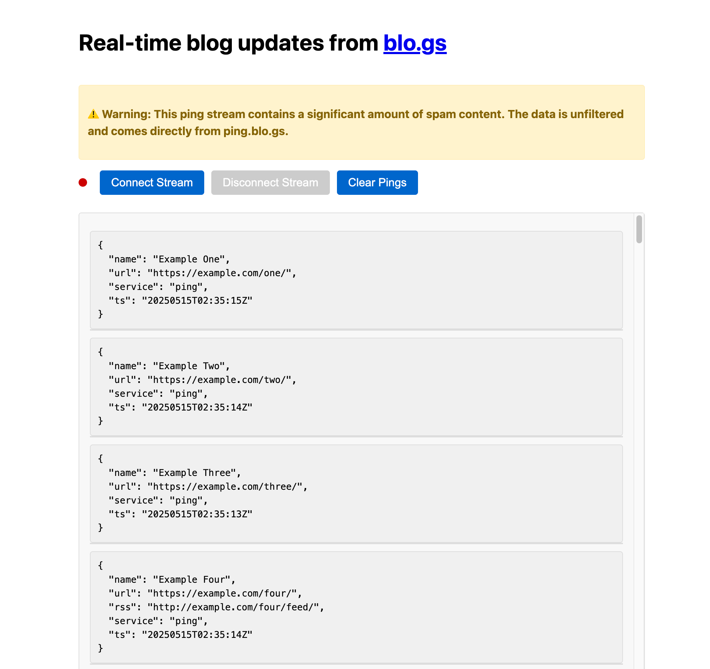

# Blogstream

<a href="https://github.com/josephscott/blogstream/actions"></a>

This takes the XML blog ping flow from <a href="http://blo.gs/">http://blo.gs/</a> and provides a JSON HTTP Server-Sent Events URL.

You can read more about it at <a href="https://josephscott.org/blog/2025/blogstream-blo-gs-updates-via-server-sent-events/">https://josephscott.org/blog/2025/blogstream-blo-gs-updates-via-server-sent-events/</a>.

## Installation

```bash
$ git clone https://github.com/josephscott/blogstream.git
$ composer install
$ make server-start
```

You can shudown the server with `make server-stop`.

## Usage

Start the server: `make server-start`

View the JSON SSE: `curl -H 'Accept: text/event-stream' -N http://localhost:39999/sse`

Visit the demo page showing the stream of pings at http://localhost:39999/



## Testing

Run tests with Pest:

```bash
make tests
```
